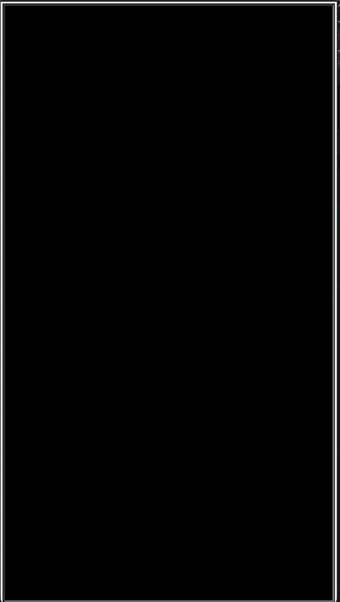

# Tetris Game in Python

## Project Description

> This project is a classic Tetris game implemented in Python, leveraging the Turtle graphics library for rendering the game interface. The main aim is to provide a fun and interactive experience for users who enjoy playing Tetris.

## Key Features

- Dynamic block movement and rotation functionality.
- A scoring system that increases as the player successfully fills rows.
- Game over display when blocks reach the top of the grid.
- Utilizes object-oriented programming principles for modular and structured codebase.-

## Technologies Used

- Python programming language (Python3)
  - [Guide to install](https://www.scaler.com/topics/python/how-to-install-python-on-macos/)
- Turtle graphics library for GUI
  - [Guide to install](https://pypi.org/project/PythonTurtle/)
- Basic Object-Oriented Programming (OOP) concepts

## Challenges and Future Features

> Some challenges faced during development included managing block movement and collision detection. Future implementations may include:

- Levels and difficulty settings.
- Enhanced graphics and animations.
- Multiplayer mode for competitive game-play.

## How to Install and Run the Project (In Your Terminal)

1. Clone the repository to your local machine
   - `git clone https://github.com/`
2. Navigate to the project directory
   - `cd Tetris`
3. Run the main Python file
   - `python main.py`

## How to Use the Project

1. Use the arrow keys to move the active block left, right, or down.
2. Press the 'Up' arrow key to rotate the block.
3. The objective is to fill complete rows to earn points and prevent the blocks from reaching the top.
4. Game over occurs when blocks cannot be placed further due to reaching the top.

## Credits

> Developed by Curtis Kokuloku
---
01-07-2024
